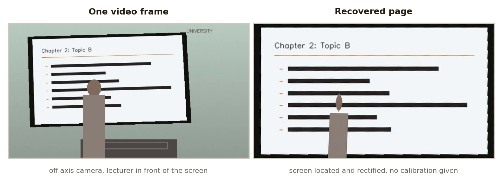

<div align="center">

# Lecture Video to PDF

Yuhyeon Lee · 2026

[](https://github.com/blueion0612/Lecture_Video_to_PDF/actions/workflows/tests.yml)
[](LICENSE)
[](https://www.python.org/)
[](#limitations)
[](https://github.com/blueion0612/Lecture_Video_to_PDF/releases)

[**Releases**](https://github.com/blueion0612/Lecture_Video_to_PDF/releases) · [**Changelog**](CHANGELOG.md)

<picture>
  <source media="(prefers-color-scheme: dark)" srcset="docs/figures/hero_before_after-dark.png">
  
</picture>

</div>

*Both images are real output: the fixture on the left, the page the pipeline recovered
from it on the right. Regenerate with `python docs/figures/make_hero.py`.*

**Lecture Video to PDF** turns a recording of a lecture into a PDF of the slides,
including what the lecturer wrote on them. It finds the projected screen or
whiteboard by itself, so there is no per-recording calibration: off-axis cameras that
leave the screen keystoned, screen captures where the slide fills the frame,
letterboxed video, and recordings whose framing changes part-way are all handled.

## What it produces

Point it at a folder of videos and it writes, per video:

| Output | Contents |
|---|---|
| `<video>_lecture_material.pdf` | the handout |
| `<video>_review.jpg` | every page as one contact sheet, for a quick check |
| `frames/` | the page images that went into the PDF |
| `extraction_report.json` | detected screen regions, scenes and annotation cycles |

The choice that matters is `--ink-mode`, which decides what a page is:

| Mode | Pages produced | Use when |
|---|---|---|
| `clean` (default) | one per slide, at its **least** annotated | you want the original handout |
| `final` | one per slide, at its **most** annotated | the writing is the content |
| `epochs` | one per **write-and-wipe cycle** | the lecturer writes, erases and writes again |
| `all` | the clean slide plus every annotation cycle | you want both |

**Why `epochs` exists.** Consider a lecturer who fills a slide with working, wipes it,
and fills it again. Keeping only the last frame loses the first board entirely.
Keeping every frame produces dozens of near-identical pages. `epochs` cuts each slide
into annotation cycles, closing one when most of the writing disappears at once, and
keeps the fullest moment of each. Both boards survive and the intermediate states do
not.

An erase has to satisfy two conditions, which is what makes this work: most of the
previous writing must be gone (`--erase-ratio`) **and** the total amount of writing
must drop sharply (`--erase-drop`). Redrawing part of a diagram satisfies only the
first, so it stays on the same page.

## Quick start

On Windows, put this folder inside the folder that holds your videos and
double-click:

```
Lectures/
  week01.mp4
  week02.mp4
  Lecture_Video_to_PDF/
    run.cmd              clean slides only
    run_with_notes.cmd   clean slides and the handwritten versions
```

The first run builds a virtual environment and installs the dependencies. Results
land in `Lectures/pdf_output`. If the environment ever breaks, run `setup.cmd`.

Anywhere else:

```bash
git clone https://github.com/blueion0612/Lecture_Video_to_PDF
cd Lecture_Video_to_PDF
pip install -e .
lecture-pdf "path/to/lectures" --output "path/to/pdf_output"
```

`python lecture_video_to_pdf.py` runs the same thing without installing.

The input may be a single video or a folder of them.

## How it works

Each video is scanned four times, and no stage holds more than a bounded number of
frames, so multi-hour recordings are fine.

### 1. Locate the slide region

A screen is the part of the frame that *changes but
does not move*. A wall does neither, a lectern or logo does not change, and the
lecturer never stops moving; those three facts together isolate the screen without
knowing anything about the room. The region is then snapped to the real physical
border by looking for straight edges, and rectified out of its perspective. Screen
captures and letterboxed video are recognized as such and left uncropped.

### 2. Find slide changes

Comparison happens in rectified slide coordinates, so the
thresholds do not depend on where the camera was placed.

- Someone walking past changes the frame a great deal and then changes it back, so a
  candidate is only accepted if the frame still differs some seconds later.
- Annotation adds to what is already there, so the check is how much of the previous
  slide survives, not how much changed.
- Color is compared as well as brightness, so two slides that differ only in hue are
  not missed.

### 3. Track annotation

Ink is not defined by pen color but as *what differs from
the slide when it first appeared*, so red, yellow and green markers, chalk, and black
pen on white all behave the same.

- A mark must persist for a while before it counts, which separates writing from a
  hand sweeping past.
- People are large and continuous while writing is thin, so the lecturer's body is
  filtered out of the ink mask.
- Whatever the lecturer occludes is treated as *unknown* rather than *erased*, so the
  state survives them standing in front of the board.

### 4. Render pages

Frames around the chosen instant are composited by median. This
recovers whatever the lecturer moved away from between those frames. It thins them
rather than erasing them: a head that sweeps across is gone, a torso that stays in
one place for most of the composited frames survives, and widening `--plate-frames`
helps only as far as the lecturer actually moves. `--no-clean-plate` renders a single
instant instead.

## Usage

```text
--ink-mode clean|final|epochs|all   what to keep, see the table above
--skip-opening-seconds 8            ignore a title animation at the start
--combine                           also write one PDF spanning every video
--cross-video-dedup                 treat slides repeated across videos as one

--sensitivity 0.12                  share of the slide that must change; lower finds more
--minimum-scene-seconds 3           ignore scenes shorter than this
--confirm-seconds 2                 how long a change must persist, ignoring passers-by

--erase-ratio 0.55                  fraction of writing that must vanish to count as an erase
--erase-drop 0.55                   how far total writing must fall for a wipe to count
--ink-settle-seconds 8              how long a mark must stay to count as writing
--minimum-ink 0.0015                ignore annotation cycles smaller than this

--output-width 0                    0 keeps the slide region's own resolution
--jpeg --jpeg-quality 95            smaller files at high quality
--no-crop                           keep the whole camera frame
--screen-corners "..."              give the four corners instead of detecting them
--no-clean-plate                    render one instant instead of compositing
--plate-frames 9                    frames composited for each page
--workers 3                         videos analyzed in parallel
--analyze-only                      report the analysis without writing anything
```

`--help` lists the full set. `--screen-corners` takes top-left, top-right,
bottom-right, bottom-left as fractions of the frame:

```text
--screen-corners "0.0844,0.0972;0.7812,0.0917;0.7820,0.7903;0.0852,0.7931"
```

<details>
<summary><b>When the result is wrong</b></summary>

| Symptom | Try |
|---|---|
| Slides are missed | `--sensitivity 0.08` |
| One slide appears several times | `--sensitivity 0.18`, `--minimum-scene-seconds 5` |
| The title animation becomes pages | `--skip-opening-seconds 10` |
| The crop includes the lectern or wall | set `--screen-corners` explicitly |
| Too many annotation pages | `--erase-drop 0.4`, `--minimum-ink 0.004` |
| Too few annotation pages | `--erase-ratio 0.7`, `--ink-settle-seconds 5` |
| The lecturer leaves a residue | `--plate-frames 15`, though see the limits below |
| You want the untouched frame | `--no-clean-plate` |

Running with `--analyze-only` first and reading `layout_segments`, `scenes` and
`annotation_epochs` in `extraction_report.json` usually shows which knob to reach for.

</details>

## Repository layout

```
lecture_pdf/
  scan.py         first pass over the video
  geometry.py     screen location, clean plates, rectification
  analysis.py     scene detection in rectified coordinates
  ink.py          annotation tracking and erase detection
  output.py       page rendering and PDF assembly
  pipeline.py     the four passes, in order
  cli.py          argument parsing and the console entry point
  video.py        frame access
  util.py         small shared helpers
tests/            synthetic recordings with known answers
docs/figures/     README figure, the script that regenerates it, figstyle.py
run.cmd  run_with_notes.cmd  setup.cmd    Windows entry points
pyproject.toml    package definition and the lecture-pdf command
requirements.txt  what setup.cmd installs; a test keeps it equal to pyproject.toml
CHANGELOG.md      what changed in each release
```

## Tests

Seven checks. Six run over five synthetic recordings whose correct answers are known
in advance:
a full-screen capture, letterboxed video, a keystoned room camera with the lecturer
occluding the screen, a recording that is reframed part-way, a write-and-erase
sequence, and PDF generation. The seventh asserts that `requirements.txt`, which the
Windows launchers install from, lists exactly what `pyproject.toml` declares.
Fixtures are built on the first run and cached afterwards, so only the first run is
slow.

```bash
python -m pytest -q
python tests/test_pipeline.py    # the six pipeline checks, without pytest
```

## Requirements

Python 3.10 or newer with NumPy, OpenCV, Pillow and PyMuPDF. Not needed if you only
use `run.cmd` and `setup.cmd`, which install into their own environment. To use it as
a library:

```bash
pip install -e .
lecture-pdf "path/to/lectures" --ink-mode all
```

## Limitations

- The detected region can include some of the monitor bezel. `--screen-corners`
  overrides it.
- **The lecturer is thinned, not removed.** Median compositing recovers what they
  moved away from; whatever they stand in front of for most of the composited frames
  stays in the page.
- Content the lecturer occludes for a whole scene cannot be recovered at all. Nothing
  is invented that is not somewhere in the video.
- Long uninterrupted annotation on one slide may split into more epochs than
  necessary. Lower `--erase-drop` to reduce that.
- Validated on one real recording setup, one lecture hall and camera, plus the five
  synthetic fixtures. Other footage may need `--sensitivity` and `--erase-drop`
  adjusted.

## License

MIT. See [LICENSE](LICENSE).
